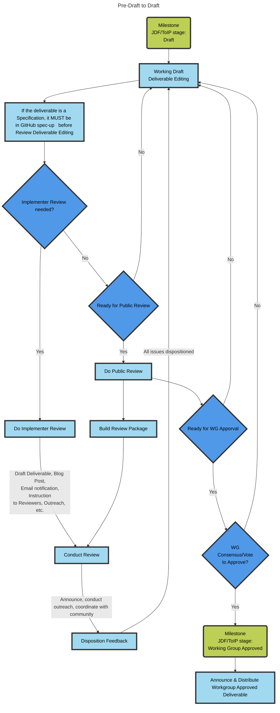

```mermaid
---
title: Pre-Draft to Draft
---

flowchart TD
    A(Milestone\nJDF/ToIP stage:\nDraft)
    B["Working Draft"\nDeliverable Editing]
    C[If the deliverable is a Specification, it MUST be in GitHub spec-up   before Review Deliverable Editing]
    D{Implementer Review needed?}
    E{Ready for Public Review}
    F[Do Implementer Review]
    G[Do Public Review]
    H[Build Review Package]
    I[Conduct Review]
    J[Disposition Feedback]
    K{Ready for WG Apporval}
    L{WG\nConsensus/Vote\nto Approve?}
    M(Milestone\nJDF/ToIP stage:\nWorking Group Approved)
    N["Announce & Distribute Workgroup Approved Deliverable"]

    A --> B
    B --> C
    C --> D
    D --> | No | E
    D --> | Yes | F
    E --> | No | B
    E --> | Yes | G
    F --> |Draft Deliverable, Blog Post,\n Email notification, Instruction\nto Reviewers, Outreach, etc.| I
    I --> |Announce, conduct outreach, coordinate with community| J
    J --> |All issues dispositioned| B
    G --> H
    H --> I
    G --> K
    K --> | No | B
    K --> | Yes | L
    L --> | No | B
    L --> | Yes | M
    M --> N

    style A fill:#BECF56,stroke:#333,color:#000,stroke-width:4px
    style M fill:#BECF56,stroke:#333,color:#000,stroke-width:4px
    
    style B fill:#A1D9F1,stroke:#333,color:#000,stroke-width:4px
    style C fill:#A1D9F1,stroke:#333,color:#000,stroke-width:4px
    style F fill:#A1D9F1,stroke:#333,color:#000,stroke-width:4px
    style G fill:#A1D9F1,stroke:#333,color:#000,stroke-width:4px
    style H fill:#A1D9F1,stroke:#333,color:#000,stroke-width:4px
    style I fill:#A1D9F1,stroke:#333,color:#000,stroke-width:4px
    style J fill:#A1D9F1,stroke:#333,color:#000,stroke-width:4px
    style N fill:#A1D9F1,stroke:#333,color:#000,stroke-width:4px

    style D fill:#5099E9,stroke:#333,color:#000,stroke-width:4px
    style E fill:#5099E9,stroke:#333,color:#000,stroke-width:4px
    style L fill:#5099E9,stroke:#333,color:#000,stroke-width:4px
    style K fill:#5099E9,stroke:#333,color:#000,stroke-width:4px
```
  