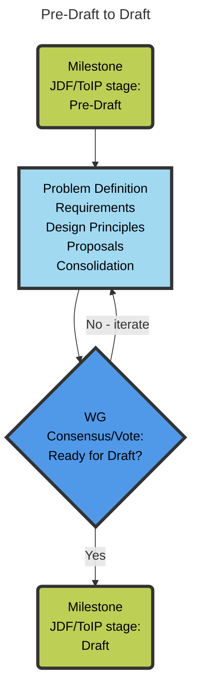

  
High Level Process

```mermaid
---
title: Pre-Draft to Draft
---

flowchart TD
    A(Milestone\nJDF/ToIP stage:\nPre-Draft)
    B[Problem Definition\nRequirements\nDesign Principles\nProposals\nConsolidation]
    C{WG\nConsensus/Vote:\nReady for Draft?}
    D(Milestone\nJDF/ToIP stage:\nDraft)
    
    A --> B
    B -->  C
    C --> |No - iterate| B
    C --> |Yes| D

    style A fill:#BECF56,stroke:#333,color:#000,stroke-width:4px
    style B fill:#A1D9F1,stroke:#333,color:#000,stroke-width:4px
    style C fill:#5099E9,stroke:#333,color:#000,stroke-width:4px
    style D fill:#BECF56,stroke:#333,color:#000,stroke-width:4px
```

