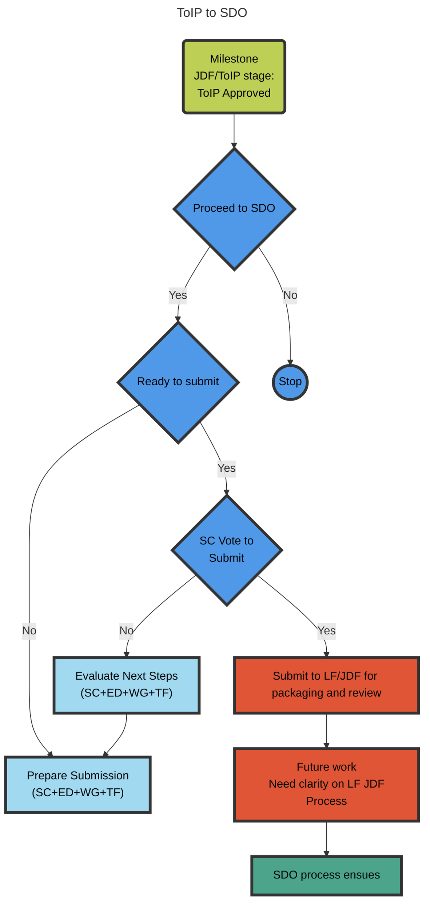

```mermaid
---
title: ToIP to SDO
---

flowchart TD
    A(Milestone\nJDF/ToIP stage:\nToIP Approved)
    B{"Proceed to SDO"}
    C{"Ready to submit"}
    D["Prepare Submission\n(SC+ED+WG+TF)"]
    E{"SC Vote to\nSubmit"}
    F["Evaluate Next Steps\n(SC+ED+WG+TF)"]
    G["Submit to LF/JDF for packaging and review"]
    H["Future work\n Need clarity on LF JDF Process"]
    I["SDO process ensues"]

    A --> B
    B --> | No | S((Stop))    
    B --> | Yes | C
    C --> | No | D
    C --> | Yes | E
    F --> D
    E --> | No | F
    E --> | Yes | G
    G --> H
    H --> I

    style A fill:#BECF56,stroke:#333,color:#000,stroke-width:4px
    
    style D fill:#A1D9F1,stroke:#333,color:#000,stroke-width:4px
    style F fill:#A1D9F1,stroke:#333,color:#000,stroke-width:4px

    style B fill:#5099E9,stroke:#333,color:#000,stroke-width:4px
    style C fill:#5099E9,stroke:#333,color:#000,stroke-width:4px
    style E fill:#5099E9,stroke:#333,color:#000,stroke-width:4px
    style S fill:#5099E9,stroke:#333,color:#000,stroke-width:4px

    style G fill:#DF5536,stroke:#333,color:#000,stroke-width:4px
    style H fill:#DF5536,stroke:#333,color:#000,stroke-width:4px

    style I fill:#4CA48A,stroke:#333,color:#000,stroke-width:4px

```