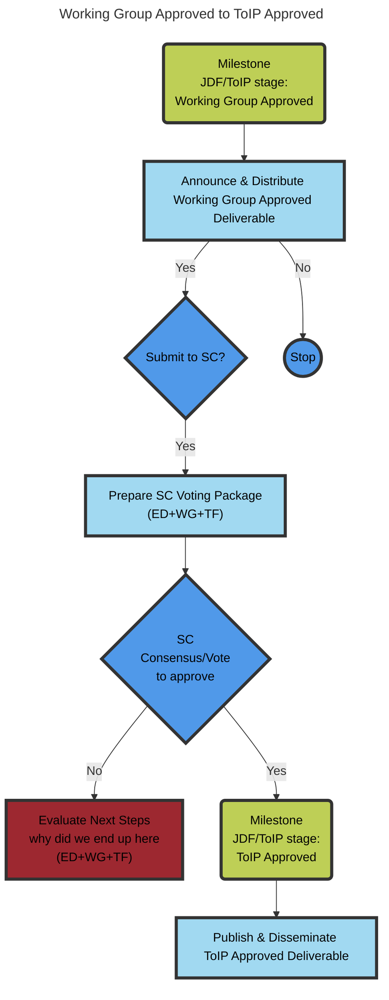

```mermaid
---
title: Working Group Approved to ToIP Approved
---

flowchart TD
    A("Milestone\nJDF/ToIP stage:\nWorking Group Approved")
    B["Announce & Distribute Working Group Approved Deliverable"]
    C{"Submit to SC?"}
    D["Prepare SC Voting Package\n (ED+WG+TF)"]
    E{"SC\n Consensus/Vote\n to approve"}
    F["Evaluate Next Steps\nwhy did we end up here\n(ED+WG+TF)"]
    G(Milestone\nJDF/ToIP stage:\nToIP Approved)
    H["Publish & Disseminate ToIP Approved Deliverable"]

    A --> B
    B --> | No | S((Stop))
    B --> | Yes | C
    C --> | Yes | D
    D --> E
    E --> | No | F
    E --> | Yes | G
    G --> H

    style A fill:#BECF56,stroke:#333,color:#000,stroke-width:4px
    style G fill:#BECF56,stroke:#333,color:#000,stroke-width:4px
    
    style B fill:#A1D9F1,stroke:#333,color:#000,stroke-width:4px
    style D fill:#A1D9F1,stroke:#333,color:#000,stroke-width:4px
    style H fill:#A1D9F1,stroke:#333,color:#000,stroke-width:4px

    style C fill:#5099E9,stroke:#333,color:#000,stroke-width:4px
    style E fill:#5099E9,stroke:#333,color:#000,stroke-width:4px
    style S fill:#5099E9,stroke:#333,color:#000,stroke-width:4px

    style F fill:#9D2830,stroke:#333,color:#000,stroke-width:4px
```